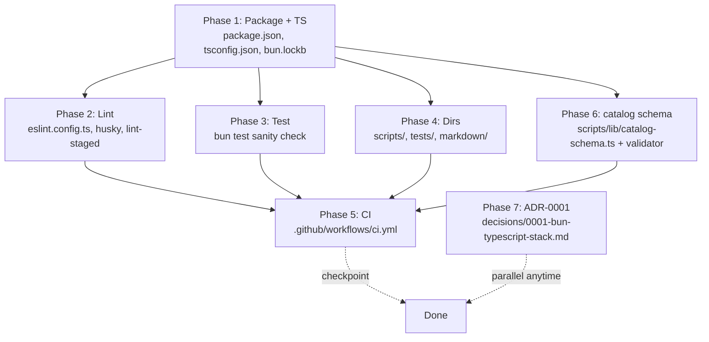
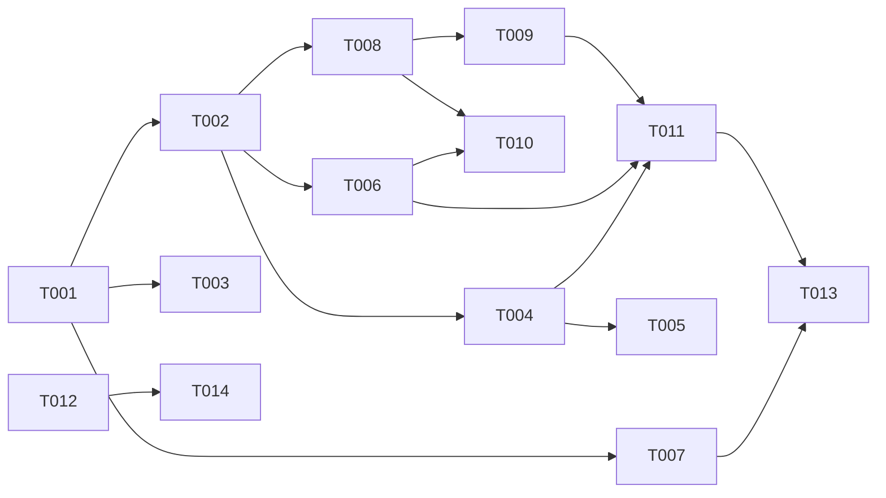

# Plan: Project Bootstrap

> Track: `project-bootstrap-20260521`
> Spec: [spec.md](./spec.md)

## Overview

- **Source**: /please:plan
- **Track**: project-bootstrap-20260521
- **Issue**: TBD
- **Created**: 2026-05-21
- **Approach**: Pragmatic — single Track shipping the full bootstrap (package + lint + test + dirs + CI + catalog schema + ADR) in one PR with phase checkpoints

## Purpose

After this change, contributors will be able to clone the repository, run `bun install`, and immediately verify the toolchain with `bun run typecheck && bun run lint && bun test` — all four succeeding against an empty source tree. They can verify it works by opening a PR and watching `.github/workflows/ci.yml` run those same commands plus a `catalog.json` schema check.

## Context

### Problem

The repository today contains only `README.md`, `LICENSE`, `NOTICE`, `ARCHITECTURE.md`, `catalog.json` (a 124-byte placeholder), and the `.please/` workspace. None of the entry points or directories that `ARCHITECTURE.md` and `tech-stack.md` describe (`scripts/`, `scripts/lib/`, `tests/`, `.github/workflows/ci.yml`, `package.json`, `tsconfig.json`, `eslint.config.ts`) exist on disk. Every future track — fetch-upstream, convert, package-release, release.yml, matrix-build.yml, nightly-detect.yml — assumes this scaffolding is present, which makes bootstrap a strict prerequisite.

### Requirements Summary

Per `spec.md`, bootstrap must deliver: (FR-1) `package.json` declaring Bun and the dev-toolchain scripts; (FR-2) `tsconfig.json` matching `tech-stack.md` exactly; (FR-3) ESLint via `@pleaseai/eslint-config` at zero warnings; (FR-4) Bun's built-in test runner; (FR-5) Husky + lint-staged pre-commit; (FR-6) `.github/workflows/ci.yml` running typecheck + lint + test; (FR-7) the agreed directory skeleton (`scripts/`, `scripts/lib/`, `tests/{unit,integration,fixtures}/`, `markdown/`); (FR-8) `catalog.json` schema validation; (FR-9) `.gitignore` covering Bun/TypeScript artifacts. Five success criteria (SC-1…SC-5) gate completion — all four toolchain commands exit 0 on a clean clone, CI passes, the pre-commit hook fires, ARCHITECTURE.md reflects on-disk reality, and lint is warnings-clean.

### Constraints

1. **`tech-stack.md` is binding.** The `tsconfig.json` must match its spec exactly (`strict`, `noUncheckedIndexedAccess`, `moduleResolution: "bundler"`, `module: "ESNext"`, `target: "ES2022"`, `noEmit: true`). The ESLint config must be `@pleaseai/eslint-config`. The test runner must be Bun's built-in.
2. **`.gitignore` is already well-formed** — `node_modules/`, `.bun/`, `dist/`, `coverage/`, `.please/state/`, and pipeline-scratch directories are all present. Only verification is needed; no rewrites.
3. **Sibling repo `@pleaseai/ask` is the reference pattern** — same Bun + TypeScript stack, same `@pleaseai/eslint-config`, same `eslint.config.ts` flat-config shape, same CI structure (SHA-pinned actions, `oven-sh/setup-bun`, `bun test --coverage`, Codecov upload). spring-docs differs by being a single package, not a turborepo monorepo, so the package layout and `tsconfig.json` deliberately diverge.
4. **ARCHITECTURE.md Code Invariants are non-negotiable**: TS strict, ESM only, zero lint warnings on `main`, pure functions in `scripts/lib/`, no submodules.
5. **OQ-1 (asciidoctor dependency) is deferred** to the convert track. Bootstrap installs only the toolchain dependencies, not runtime parsing libraries.
6. **OQ-2 (ADR-0001)** captures the Bun + TypeScript + Bun test stack decision so the next track has a single named source for "why this stack."
7. **OQ-3 (catalog.json zod schema)** is in scope: `catalog.json` already has a documented shape in `ARCHITECTURE.md`; encoding it as a zod schema and validating in CI prevents accidental drift before release.yml even exists.

### Non-Goals

- Any conversion logic, AsciiDoc parsing, or runtime parsing dependencies (`asciidoctor`, etc.) — those belong in the convert track.
- Workflows beyond `ci.yml` (`matrix-build.yml`, `nightly-detect.yml`, `release.yml`) — separate tracks each.
- Renovate / Dependabot configuration — deferred until runtime dependencies stabilize.
- Finalized release-please strategy for the `tooling-v*` namespace — deferred to a later ADR.
- Any content under `markdown/<project>/<version>/` — populated by the release track.
- Publishing the package to npm — this repo is a scripts + content repo, never published as an npm package.

## Architecture Decision

The plan ships seven phases in a single PR rather than splitting into multiple tracks. Splitting would inflate workspace overhead (3+ tracks, 3+ PRs) without delivering any independent value — none of the seven phases produces a usable artifact on its own. A single PR with phase-boundary checkpoint commits gives clean atomic rollback per phase while keeping review scope coherent.

Within the PR, the seven phases stay sequential because each later phase exercises infrastructure built by the earlier one:

1. **Phase 1 — Package + TypeScript baseline** establishes `bun install` + `bun run typecheck`.
2. **Phase 2 — Lint tooling** depends on the package being installable.
3. **Phase 3 — Test runner** depends on Bun being declared as the package manager.
4. **Phase 4 — Directory skeleton** is independent but cheap; placed here so Phase 5's CI can reference real paths.
5. **Phase 5 — CI workflow** invokes all the commands the prior phases configured.
6. **Phase 6 — catalog.json zod schema** uses the test runner and adds itself to CI.
7. **Phase 7 — ADR-0001** captures the stack decision for traceability.

Within each phase, parallelism is marked where files don't share editing locks (e.g., independent config files in Phase 2 can be created in parallel).

The `tsconfig.json` matches `tech-stack.md` literally — `noEmit: true`, no `outDir`, no `declaration`. This repo is a **scripts project**, not a publishable library; the `@pleaseai/ask` `tsconfig.json` (`declaration: true`, `outDir: "./dist"`, `moduleResolution: "Node16"`) is the wrong template here and is deliberately not copied.

## Architecture Diagram

## Tasks

- [ ] T001 Initialize package.json with Bun + TypeScript scripts (file: package.json)
- [ ] T002 Add tsconfig.json matching tech-stack.md exactly (file: tsconfig.json) (depends on T001)
- [ ] T003 Verify .gitignore covers bootstrap artifacts (file: .gitignore) (depends on T001)
- [ ] T004 [P] Add eslint.config.ts using @pleaseai/eslint-config (file: eslint.config.ts) (depends on T002)
- [ ] T005 [P] Configure Husky + lint-staged for pre-commit (file: .husky/pre-commit) (depends on T004)
- [ ] T006 Add sanity test to prove Bun test harness works (file: tests/sanity.test.ts) (depends on T002)
- [ ] T007 [P] Create directory skeleton with .gitkeep markers (file: scripts/.gitkeep) (depends on T001)
- [ ] T008 Define catalog.json zod schema (file: scripts/lib/catalog-schema.ts) (depends on T002)
- [ ] T009 Add catalog.json validation script (file: scripts/validate-catalog.ts) (depends on T008)
- [ ] T010 Add tests for catalog schema (file: tests/unit/catalog-schema.test.ts) (depends on T008, T006)
- [ ] T011 Author .github/workflows/ci.yml (typecheck + lint + test + validate-catalog) (file: .github/workflows/ci.yml) (depends on T004, T006, T009)
- [ ] T012 [P] Write ADR-0001 capturing Bun + TypeScript + Bun test stack decision (file: .please/docs/decisions/0001-bun-typescript-stack.md)
- [ ] T013 Update ARCHITECTURE.md to reflect newly created paths (remove _(Planned)_ from bootstrap-completed items only) (file: ARCHITECTURE.md) (depends on T007, T011)
- [ ] T014 Update decisions/index.md with ADR-0001 entry (file: .please/docs/decisions/index.md) (depends on T012)

## Dependencies

## Key Files

### Create

- `package.json` — Bun runtime declaration, devDependencies (typescript, @pleaseai/eslint-config, eslint, husky, lint-staged, zod), scripts (`typecheck`, `lint`, `lint:fix`, `test`, `test:coverage`, `validate-catalog`, `prepare`).
- `tsconfig.json` — Exact match to `tech-stack.md`: `strict`, `noUncheckedIndexedAccess`, `moduleResolution: "bundler"`, `module: "ESNext"`, `target: "ES2022"`, `noEmit: true`. Include `scripts/**/*` and `tests/**/*`.
- `eslint.config.ts` — Flat config importing `@pleaseai/eslint-config`. Matches `@pleaseai/ask` shape.
- `.husky/pre-commit` — Runs `bunx lint-staged`.
- `.lintstagedrc.json` (or `lint-staged` field in package.json) — Maps `*.{ts,tsx}` → `eslint --fix`.
- `tests/sanity.test.ts` — Single passing test (`expect(true).toBe(true)` or similar) to prove the harness loads.
- `scripts/.gitkeep`, `scripts/lib/.gitkeep`, `tests/unit/.gitkeep`, `tests/integration/.gitkeep`, `tests/fixtures/.gitkeep`, `markdown/.gitkeep` — Directory markers per FR-7.
- `scripts/lib/catalog-schema.ts` — zod schema for `catalog.json` matching the shape documented in `ARCHITECTURE.md` (`version: "1"`, `generated_at`, `projects: { <project>: { <version>: { tag, released_at } } }`).
- `scripts/validate-catalog.ts` — CLI script that parses `catalog.json` against the schema, exits 1 on failure.
- `tests/unit/catalog-schema.test.ts` — Unit tests for the schema (valid sample passes, missing-field samples fail, extra-field samples handled per `.passthrough()` decision).
- `.github/workflows/ci.yml` — Job(s) running `bun install --frozen-lockfile`, `bun run typecheck`, `bun run lint`, `bun test --coverage`, `bun run validate-catalog`. SHA-pinned actions, Bun setup via `oven-sh/setup-bun`. Optional: Codecov upload mirroring `@pleaseai/ask`.
- `.please/docs/decisions/0001-bun-typescript-stack.md` — ADR following `standards:adr` format, recording rationale for Bun, TypeScript strict config, Bun test, and `@pleaseai/eslint-config`.

### Modify

- `.gitignore` — Verify and add only what is missing. Current file already covers `node_modules/`, `.bun/`, `dist/`, `coverage/`, `.please/state/`, `.cache/`, `tmp/`, `upstream/`. Candidates to add (if not already covered by patterns): `bun.lockb` is **not** ignored (intentionally committed). Confirm `*.tsbuildinfo` handling.
- `ARCHITECTURE.md` — Remove `_(Planned)_` markers from sections whose paths now exist (`scripts/` exists with `.gitkeep`, `.github/workflows/` exists with `ci.yml`, `tests/` exists with skeleton). Leave `_(Planned)_` on the actual conversion scripts (`fetch-upstream.ts`, `convert.ts`, etc.) which remain unimplemented.
- `.please/docs/decisions/index.md` — Append a row for ADR-0001.

### Reuse

- `catalog.json` — Stays as the current 124-byte placeholder. The schema in T008 validates this exact shape. Released-content updates land via the release Track.
- `.please/docs/knowledge/tech-stack.md` — Authoritative reference for `tsconfig.json` and tooling choices. The plan does not modify it.
- `.please/docs/knowledge/workflow.md` — Authoritative reference for TDD cadence, quality gates, and dev commands. Already aligned with this plan; no changes.
- `LICENSE`, `NOTICE`, `README.md` — Unchanged.

## Verification

### Automated Tests

- [ ] `bun test` exits 0 with at least one passing test (T006 sanity test).
- [ ] `bun test tests/unit/catalog-schema.test.ts` passes valid-shape and rejects invalid-shape fixtures (T010).
- [ ] `bun run typecheck` exits 0 against the empty source tree plus catalog-schema files.
- [ ] `bun run lint` exits 0 with zero warnings.
- [ ] `bun run validate-catalog` exits 0 against the current `catalog.json`.
- [ ] CI workflow (`ci.yml`) passes on a draft PR — all four checks (typecheck, lint, test, validate-catalog) green.

### Observable Outcomes

- After `bun install`, `node_modules/` exists and `bun.lockb` is created.
- Running `bun run typecheck` shows zero errors and exits silently (or with a one-line success summary from `tsc`).
- Running `bun run lint` shows `eslint --max-warnings 0` succeeded with no output beyond the eslint summary.
- Running `bun test` shows `1 pass, 0 fail` (or the current sanity-test count).
- Opening a PR triggers `ci.yml` and the GitHub Checks tab shows green checkmarks for typecheck / lint / test / validate-catalog.
- Staging a `.ts` file and running `git commit` triggers the Husky pre-commit hook, which runs `eslint --fix` on staged files and proceeds to commit only if lint passes.

### Manual Testing

- [ ] Clone the repo into a fresh directory; run `bun install && bun run typecheck && bun run lint && bun test`; all four exit 0 (SC-1).
- [ ] Open a draft PR; confirm `ci.yml` runs and passes (SC-2).
- [ ] Stage a deliberately misformatted `.ts` file (extra spaces, missing semicolons); run `git commit`; confirm Husky reformats it via `eslint --fix` before the commit lands (SC-3).
- [ ] Read updated `ARCHITECTURE.md`; confirm `_(Planned)_` markers are removed from bootstrap-completed paths but retained on still-planned conversion scripts (SC-4).
- [ ] Run `bun run lint -- --max-warnings 0`; confirm zero warnings reported (SC-5).
- [ ] Corrupt `catalog.json` (e.g., set `version` to `"2"`); run `bun run validate-catalog`; confirm exit code 1 and a clear error message; revert the file.

### Acceptance Criteria Check

- [ ] **SC-1** — `bun install && bun run typecheck && bun run lint && bun test` all exit 0 on a clean clone.
- [ ] **SC-2** — PR triggers `.github/workflows/ci.yml` and all jobs pass.
- [ ] **SC-3** — Husky pre-commit hook runs `eslint --fix` on staged TypeScript files.
- [ ] **SC-4** — `ARCHITECTURE.md` reflects the on-disk layout for bootstrap-completed parts (with `_(Planned)_` retained for still-future code).
- [ ] **SC-5** — `bun run lint` reports zero warnings.

## Decision Log

- Decision: Single PR (Pragmatic) over split bootstrap / bootstrap-ci tracks
  Rationale: No phase produces independent user value; splitting inflates workspace overhead without reducing risk. Phase-boundary checkpoint commits give rollback granularity.
  Date/Author: 2026-05-21 / Claude (/please:plan)

- Decision: Defer asciidoctor (OQ-1) to convert track
  Rationale: Bootstrap should not pin runtime dependencies before the convert track's ADR settles parser choice. Adding it speculatively risks lock-in.
  Date/Author: 2026-05-21 / Claude (/please:plan)

- Decision: Author ADR-0001 in this track (OQ-2)
  Rationale: tech-stack.md captures the *what*; an ADR captures the *why* in immutable form for future tracks to reference.
  Date/Author: 2026-05-21 / Claude (/please:plan)

- Decision: Define catalog.json zod schema in this track (OQ-3)
  Rationale: ARCHITECTURE.md already documents the shape; encoding now prevents drift before release.yml exists. The cost is one schema file and one validator script — both trivial.
  Date/Author: 2026-05-21 / Claude (/please:plan)

- Decision: tsconfig.json does NOT copy @pleaseai/ask's shape
  Rationale: ask is a publishable library (`declaration: true`, `outDir`, `moduleResolution: "Node16"`). spring-docs is a scripts project per tech-stack.md (`noEmit: true`, `moduleResolution: "bundler"`). Following ask here would violate tech-stack.md.
  Date/Author: 2026-05-21 / Claude (/please:plan)

## Progress

- [x] (2026-05-21 17:28 KST) T001 Initialize package.json with Bun + TypeScript scripts
  Evidence: `bun install` → 378 packages installed; `bun --version` → 1.3.14
- [x] (2026-05-21 17:31 KST) T002 Add tsconfig.json matching tech-stack.md exactly
  Evidence: `bun run typecheck` → exit 0 (after T006 added the first `.ts` file; see Surprises)
- [x] (2026-05-21 17:33 KST) T003 Verify .gitignore covers bootstrap artifacts
  Evidence: Added `*.tsbuildinfo`; all other patterns already present
- [x] (2026-05-21 17:39 KST) T004 Add eslint.config.ts using @pleaseai/eslint-config
  Evidence: `bun run lint` → exit 0 (after `--fix` reordered package.json + tsconfig.json keys)
- [x] (2026-05-21 17:41 KST) T005 Configure Husky + lint-staged for pre-commit
  Evidence: staged `const   x  =   42  ;` → hook rewrote to `const x = 42`
- [x] (2026-05-21 17:32 KST) T006 Add sanity test to prove Bun test harness works
  Evidence: `bun test tests/sanity.test.ts` → 2 pass, 0 fail
- [x] (2026-05-21 17:32 KST) T007 Create directory skeleton with .gitkeep markers
  Evidence: scripts/, scripts/lib/, tests/{unit,integration,fixtures}/, markdown/ — all with .gitkeep
- [x] (2026-05-21 17:42 KST) T008 Define catalog.json zod schema
  Evidence: `scripts/lib/catalog-schema.ts` exports `CatalogSchema` + `CATALOG_VERSION`
- [x] (2026-05-21 17:42 KST) T009 Add catalog.json validation script
  Evidence: `bun run validate-catalog` → ✓ valid; corrupt version='2' → exit 1 with clear message
- [x] (2026-05-21 17:43 KST) T010 Add tests for catalog schema
  Evidence: 8 cases (placeholder, populated, wrong version, missing projects/tag, bad/null released_at, bad tag) — all pass
- [x] (2026-05-21 17:43 KST) T011 Author .github/workflows/ci.yml
  Evidence: SHA-pinned checkout/setup-bun/codecov; jobs: install + typecheck + lint + validate-catalog + test (coverage + JUnit)
- [x] (2026-05-21 17:45 KST) T012 Write ADR-0001 capturing Bun + TypeScript + Bun test stack decision
  Evidence: `.please/docs/decisions/0001-bun-typescript-stack.md` (Accepted, dated 2026-05-21)
- [x] (2026-05-21 17:46 KST) T013 Update ARCHITECTURE.md to reflect newly created paths
  Evidence: removed _(Planned)_ from scripts/, .github/workflows/, tests/, markdown/ headings; added file rows for ci.yml + validate-catalog.ts + catalog-schema.ts; retained _(Planned)_ on still-future conversion code
- [x] (2026-05-21 17:45 KST) T014 Update decisions/index.md with ADR-0001 entry
  Evidence: Index row added; status "Accepted"

## Surprises & Discoveries

- Observation: `tsc --noEmit` against an empty `include: ["scripts/**/*", "tests/**/*"]` fails with `TS18003: No inputs were found`
  Evidence: Initial T002 verification failed; `tsc` requires at least one matching `.ts` file (`.gitkeep` does not satisfy). Resolution: implement T007 (directory skeleton) and T006 (sanity test) before re-verifying T002. Plan dependencies allow this reordering (T002, T006, T007 all depend only on T001). Captured for future tracks: when `tsconfig.json` `include` is non-default, the first `.ts` file must land before typecheck verification can succeed.
- Observation: `@pleaseai/eslint-config` lints YAML + JSONC by default and enforces `jsonc/sort-keys`
  Evidence: First `bun run lint` reported 19 errors against `.please/config.yml`, `package.json`, and `tsconfig.json`. Resolution: (a) extend `ignores` to cover the full `.please/` directory (workspace meta, not source), and (b) accept `--fix` reordering of `package.json` and `tsconfig.json` keys. The key reorderings are semantic no-ops; the values are identical. Captured: future tracks adding YAML configs under `.please/` will not be linted, but YAML configs elsewhere (e.g., `.github/workflows/`) will be.
- Observation: ESLint requires `process` to be imported from `node:process`, not used as a global
  Evidence: `scripts/validate-catalog.ts` initially used the global `process` and failed lint (4 occurrences). Resolution: `import process from 'node:process'`. Captured for future scripts: prefer explicit `node:*` imports for `process`, `fs`, `path`, etc.

## Notes

- Renovate / Dependabot configuration is deliberately out of scope — see workflow.md and tech-stack.md note about deferring it until deps stabilize.
- The CI workflow's Codecov integration is optional; including it matches `@pleaseai/ask` but requires `CODECOV_TOKEN` to be configured in repo secrets. If the secret isn't set, mark Codecov upload as `continue-on-error: true` to avoid blocking PRs.
- The `prepare` script in package.json should invoke `husky` so post-clone `bun install` wires up git hooks automatically.
- Decision on `.lintstagedrc.json` file vs inline `lint-staged` field in `package.json`: keep inline for fewer top-level files; revisit if the config grows past 3 entries.
